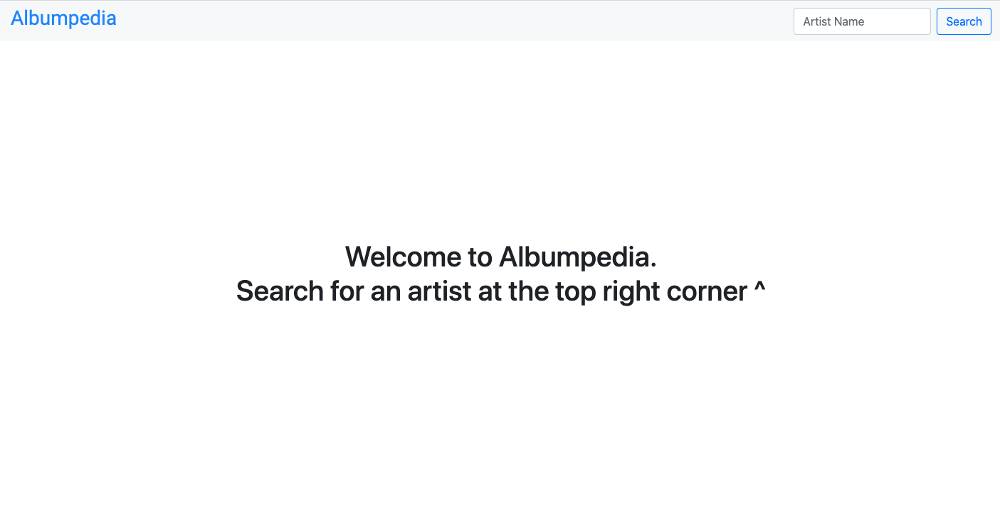
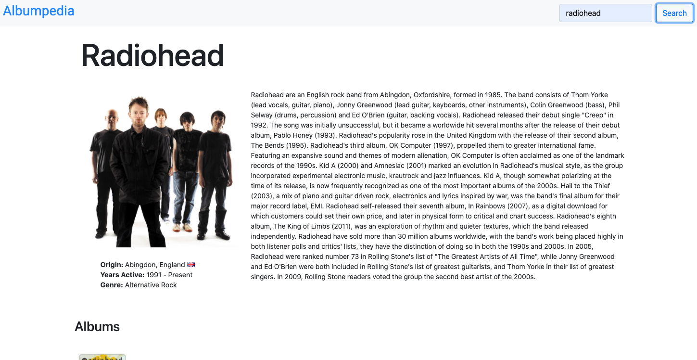
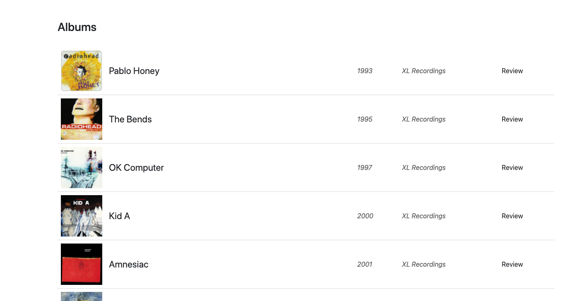
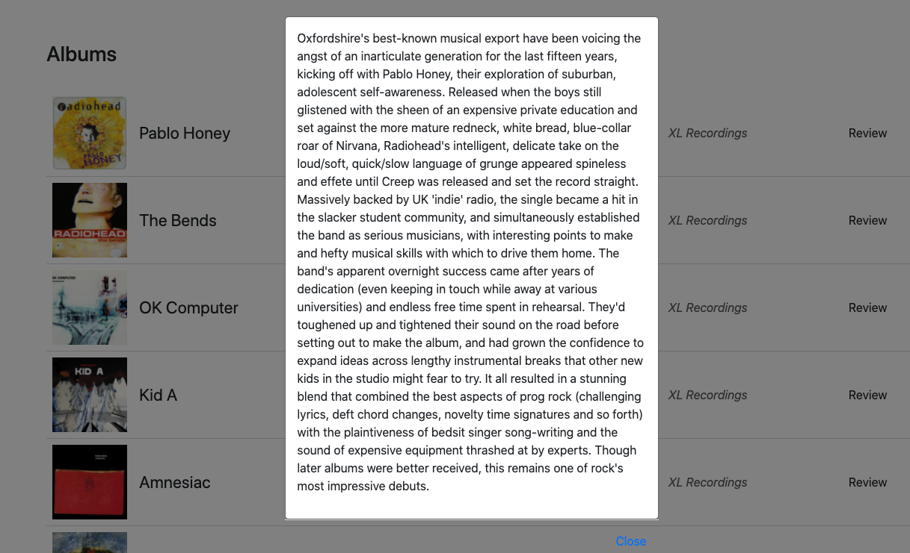
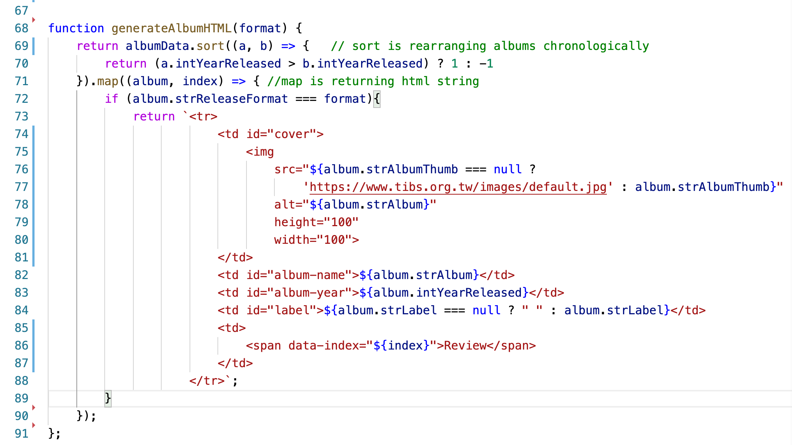
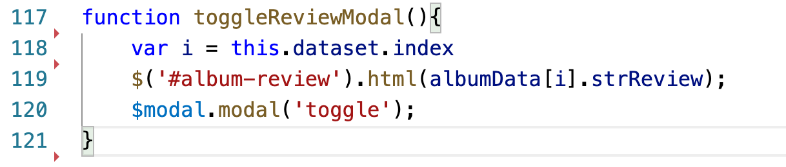

### Albumpedia app by Jack Lambert, July 2020

Link to the application [here](https://jacklmbrt07.github.io/albumpedia/)

A simple app which retrieves data from [www.theaudiodb.com](www.theaudiodb.com)

Enter in a musician or music artist in the search bar, Enter search button, and
a wiki like webpage will render showing the artists stats, photo, biography.

below that is a table of the artist's published recordings, sorted by albums, EPs, and Live albums. 

Click 'review' to see a review from a critic.

#### Languages used:
- HTML 
- CSS
- Javascript
- Bootstrap
- jQuery (with ajax function)
- REST API
- MDBootstrap (for flag icons)

API Key is hidden.

Two ajax requests are used, one to retrieve artist info and another to retrieve album info.

Homepage is included.

##### Screenshots

Home Page

Artist Biography and Header

Artist Recordings Table

Album Review Modal

### functions of interest

The `generateAlbumHTML` function takes the album data about the specified artist retrieved the database, sorts it in chronological order, and then is called based on the type of format specified. Notice the index used in the span of the last table data, which is used in the `toggleReviewModal` function.

With help from my instructor, I was able to successfully pull the data from the API and generate inside the single modal, rather than generating one modal per each album.

